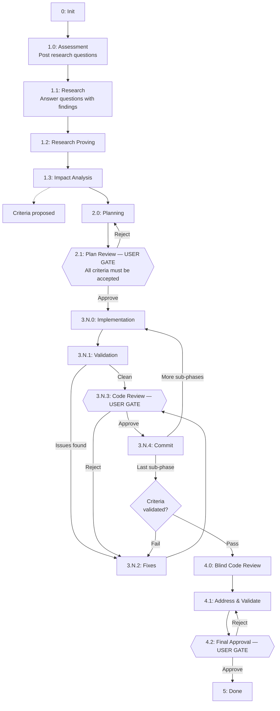

# Claude Governed Workflow

A zero-trust orchestration layer for Claude Code that enforces phase progression, scope constraints, and human approval gates on agentic coding sessions. Instead of letting the agent self-certify its work, every phase transition is validated server-side — research must be proven, file edits are scope-locked, and critical checkpoints require explicit human approval through the admin panel.

The system ships as a set of Claude Code extensions: agent definitions, hook scripts, skills, and a Flask-based admin panel with an MCP server.

## How It Works

The workflow moves through assessment, research, planning, execution, review, and delivery. Three transitions are **user gates** that halt progress until a human approves or rejects via the admin panel.



Hexagonal nodes are **user gates** — the workflow pauses until a human approves or rejects. Diamond nodes are validation checkpoints. Rectangular nodes advance automatically when their criteria are met.

## Key Concepts

**Phase advancement.** The agent calls `workspace_advance` — the backend decides the next phase. Each phase has an advancer that validates prerequisites (progress documented, research proven, scope changes present, commit hash valid). Failures return specific errors explaining what's missing.

**User gates.** Plan Review (2.1), Code Review (3.N.3), and Final Approval (4.2) generate cryptographic nonces. Only the admin panel UI can present them, ensuring the agent cannot self-approve.

**Scope locking.** Each execution sub-phase defines `must` (required changes) and `may` (permitted boundary) file patterns. Pre-tool hooks enforce these at edit time — the agent physically cannot write outside its scope. Scope and plan carry separate approval statuses. Updating either one auto-revokes its approval, requiring the user to re-approve before execution can continue.

**Research proving.** Researchers save findings with typed proofs (code:file:line, web:url, diff:commit). A separate prover agent verifies every proof before the workflow continues. No unproven claims pass. Rejected entries must be re-researched and re-proven before the workflow is allowed to advance past the research proving phase.

**Research discussions.** The agent posts research questions during assessment. Each question must be linked to at least one research entry before the workflow can advance past the research phase. Users can review questions, add their own, and reply in threaded discussions.

**Acceptance criteria.** During assessment and planning, the agent proposes acceptance criteria (unit tests, integration tests, BDD scenarios, custom checks) via MCP. Users accept or reject them in the admin panel. On the last execution commit, the server programmatically validates test-type criteria — it checks that named test methods actually exist in the specified test files. Plan approval is blocked if any criteria remain unresolved.

**Plan structure.** The execution plan includes system diagrams (class diagram and sequence diagrams in Mermaid) and tasks organized into sub-phases. Tasks can declare parallel groups for fork/join execution. Each sub-phase has its own scope (must/may file patterns), so different sub-phases can touch completely different parts of the codebase.

**Execution sub-phases.** The plan defines N sub-phases (3.1, 3.2, ...), each cycling through Implementation, Validation, Fixes, Code Review, and Commit. Production code and tests are always written by separate agents to maintain objectivity.

**Agent roles.** The orchestrator coordinates 16 specialized agent roles. A plan-advisor runs as a persistent teammate across the entire session. Production code and tests are always written by separate agents — engineers never write tests, test engineers never write production code. Phase 4.0 reviewers work blind with zero implementation context.

**Review system.** All review feedback — user comments, agent findings, and blind reviewer issues — lives in a single `discussions` table with `scope='review'`. Each review item carries a `resolution` status (`open`, `fixed`, `false_positive`, `out_of_scope`). Agents set the resolution after addressing feedback; users resolve items in the admin panel. A cross-cutting `ReviewGuard` blocks phase advancement until all review items are user-resolved. This applies to execution phases (3.N.K), address & fix (4.1), and final approval (4.2).

**Session recovery.** When a session ends (context compaction or restart), all teammates are lost. The orchestrator re-spawns them using progress entries that document what happened at each phase — actions taken, obstacles hit, decisions made, files changed.

## Repository Structure

```
├── admin-panel/          # Flask web app + MCP server (see admin-panel/README.md)
│   ├── server/           #   Backend: routes, advance logic, MCP tools, tests
│   └── templates/        #   Frontend: HTML, CSS, JS (vanilla SPA)
├── agents/               # Agent role definitions (16 specialized roles)
├── hooks/                # Claude Code hook scripts
│   ├── pre-tool-hook.sh  #   Scope enforcement, edit gating, curl blocking
│   ├── session-start.sh  #   Session registration with admin panel
│   └── user-prompt-submit.sh  # Orchestrator role enforcement
├── skills/               # Claude Code slash-command skills
│   ├── governed-workflow/ #   Full orchestrated workflow (/governed-workflow)
│   ├── stride/           #   Lightweight version without backend (/stride)
│   └── ...               #   Code review, commit-push-mr, workflow-migration
├── rules/                # Coding standards, test standards, validation pipeline
└── defaults/             # Git hook templates, MCP config template
```

## Getting Started

See [admin-panel/README.md](admin-panel/README.md) for setup, installation, API reference, and MCP tool documentation.

## Two Workflow Modes

| | Governed (`/governed-workflow`) | Stride (`/stride`) |
|---|---|---|
| Backend | Flask + SQLite + MCP server | None |
| Phase enforcement | Server-validated, scope-locked | Conversational discipline |
| User gates | 3 hard gates with nonce tokens | Plan approval only |
| Agent team | 16 specialized roles, persistent teammates | Sub-agents as needed |
| Best for | High-stakes changes, multi-file refactors | Smaller tasks, quick iterations |
